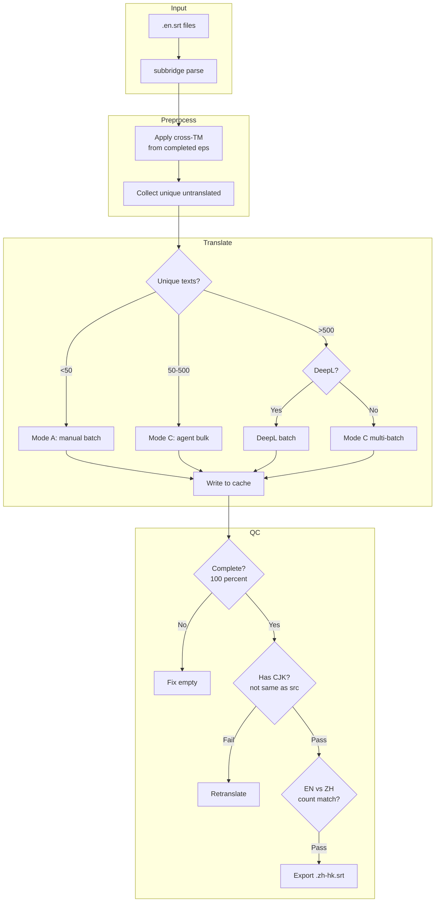
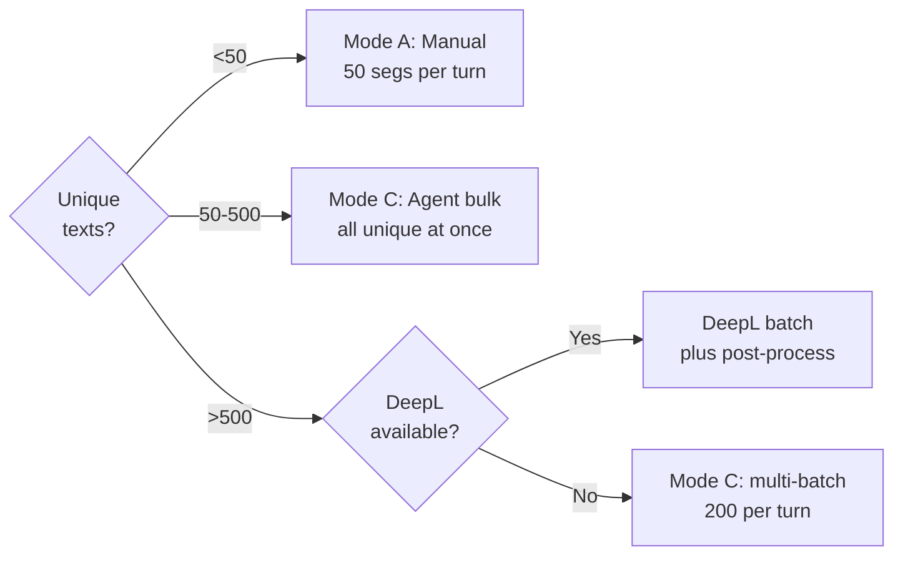
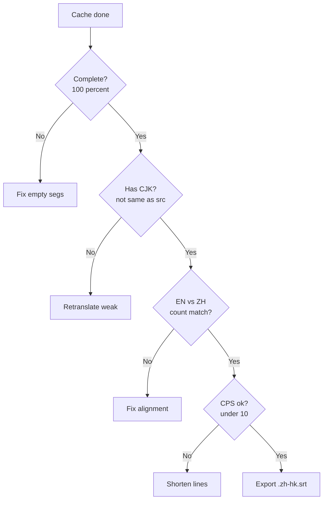

# subBridge — Subtitle Translation Skill

Agent-powered subtitle translation for [opencode](https://opencode.ai). Translates **SRT/ASS/VTT/SUB/SMI/LRC** with format preservation, multi-region support, and automatic glossary building.

```
https://github.com/hug0-l/subBridge-skill
```

## Pipeline



## Quick Start — Mode C (Recommended)

```bash
# 1. Parse all episodes
python -m workflow parse --src Z:/Videos/Anime/Series/Season\ 1 --work work/

# 2. Apply cross-TM
python -m workflow apply-tm --work work/ --tm work/tm.json

# 3. Collect unique untranslated → agent fills translated_text
python -m workflow collect --cache work/cache_ep01.json --out work/unique_ep01.json

# 4. Apply agent translations
python -m workflow apply --cache work/cache_ep01.json --tm work/unique_ep01.json

# 5. Verify + Export
python -m workflow verify --cache work/cache_ep01.json
python -m workflow export --cache work/cache_ep01.json --out work/ep01.zh-hk.srt
```

## Quick Start — DeepL (if API key available)

```bash
pip install deepl
python -c "
import deepl, json
t = deepl.Translator('YOUR_KEY:fx')
texts = ['Hello', 'How are you?']
results = t.translate_text(texts, target_lang='ZH')
for r in results: print(r.text)
"
```

## Quick Start — Mode A (Manual)

```bash
python -m batch read work/cache.json --size 50 --output work/batch.json
# → agent translates each segment → write translations_001.json
python -m batch write work/cache.json work/translations_001.json
# → loop until batch read returns []
```

## 3 Translation Modes



| Mode | Name | Engine | Best for | Quality |
|------|------|--------|----------|---------|
| **A** | Manual | Agent batch-by-batch | <50 unique texts | ⭐⭐⭐⭐⭐ |
| **B** | Auto | auto_translate + subagent | Sound effects + short phrases | ⭐⭐⭐ |
| **C** | Agent Bulk | Agent translates ALL unique | **50-500 unique texts — default** | ⭐⭐⭐⭐⭐ |

## QC Gate



## Lessons Learned (99-episode production run)

1. **Subagents lie** — always verify with `has_cjk()` check, never trust self-reported completion
2. **googletrans broken** — Google blocks IP, version conflicts, garbles romaji
3. **DeepL API works** — stable, ZH=Traditional Chinese, 500K chars/month free
4. **Keep Latin spells + JP lyrics as-is** — `Noctu Orfei`, `watashitachi wa dare datte...`
5. **Dedup before translate** — OP/ED repeats 30-110× per series, translate once
6. **Fix names post-translate** — DeepL mangles character names, always post-process

## ASR Pipeline (Speech → Translation)

```bash
# One command: ASR + parse + collect unique texts
python -m asr_pipeline --input episode.mkv --language ja

# Output: episode.srt (ASR) + work/unique.json (for agent)
```

### Backends

| Backend | Hardware | Speed | Accuracy | Model |
|---------|----------|-------|----------|-------|
| `faster-whisper` | CPU / any | ⚡ Fast | 🟡 Good | `tiny`/`base`/`small` |
| `whisperx` | NVIDIA GPU | 🐢 Slow | 🟢 High | `large-v3-turbo` |

### Direct ASR (no translation)

```bash
python -m extract asr --input episode.mkv --language ja
python -m extract asr --input episode.mkv --language en --model base
python -m extract asr --input episode.mkv --backend whisperx --model large-v3-turbo
```

## Features

- **Format-safe**: SRT/ASS/VTT/SUB/SMI/LRC — timing, styles, karaoke, drawings preserved
- **Context-aware**: `--context military/medical/casual/auto`
- **Market-aware CPS**: `--market nordic(14)/western(12)/asia(10)`
- **Bilingual export**: `--bilingual` — source + translation per segment
- **Bilingual ASS detection**: `detect.py --deep` — finds CN-style tracks in dual JP+CN files
- **Directory scanner**: `detect.py --scan --deep` — inventory all subtitle languages
- **Glossary update**: Wikipedia merge for character/place names
- **DeepL integration**: batch translate with name post-processing
- **Agent workflow**: `workflow.py` — parse → collect → translate → apply → verify → export
- **Japanese support**: 80+ JP common phrases, medical terms, sound effects
- **Credit footer**: `# AI-translated by subbridge` at end
- **Softsub extraction**: ffmpeg-based from MKV/MP4

## Project Structure

```
├── README.md                     # This file
├── SKILL.md                      # Full documentation (1900+ lines)
├── subbridge/
│   ├── workflow.py               # Mode A/C agent workflow
│   ├── asr_pipeline.py           # ASR → parse → translate pipeline
│   ├── parse.py                  # Subtitle parser (6 formats)
│   ├── export.py                 # Exporter (bilingual, credit footer)
│   ├── batch.py                  # Batch read/write
│   ├── glossary.py               # Discover + fetch + lock + update
│   ├── auto_translate.py         # Context-aware auto-translate engine
│   ├── prompt_builder.py         # Standardized subagent prompt generator
│   ├── verify.py                 # Completeness + quality + alignment
│   ├── detect.py                 # Language/encoding + deep bilingual detection
│   ├── extract.py                # Softsub extraction + ASR
│   ├── convert.py                # Format conversion
│   └── helpers.py                # Shared utilities
├── examples/                     # Example workflows
└── references/
    └── subagent_prompt_template.md
```

## Requirements

```
pip install pysubs2 httpx chardet deepl    # deepl optional
ffmpeg (optional, for softsub extraction)
```

## License

MIT
