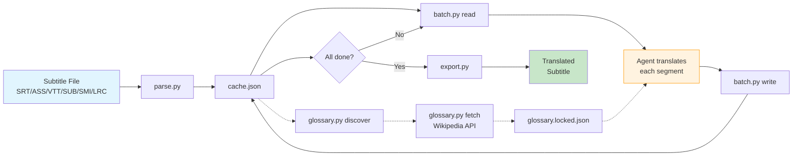

# subBridge — Subtitle Translation Skill

Agent-powered subtitle translation tool for opencode. Translates SRT/ASS/VTT/SUB/SMI/LRC with complete format preservation, multi-region support, and automatic glossary building via Wikipedia API.

## Pipeline



## Quick Start

```bash
pip install pysubs2 httpx chardet

# Parse subtitle
cd subbridge
python parse.py --input episode.srt --target-lang zh --region tw -o work/cache.json

# Auto-build glossary
python glossary.py fetch --cache work/cache.json --source-lang en --target-lang zh --region tw -o work/glossary.populated.json --limit 50

# Translate (loop until done)
python batch.py read work/cache.json --size 50 --output work/batch.json
# → agent translates batch.json → work/translations_001.json
python batch.py write work/cache.json work/translations_001.json

# Export
python export.py --cache work/cache.json -o output_translated.srt
```

## Features

- **Format-safe**: SRT/ASS/VTT/SUB/SMI/LRC — preserves timing, styling, drawing, karaoke
- **Glossary**: Wikipedia API auto-lookup + agent webfetch fallback
- **Multi-region**: zh-tw/cn/hk, pt-pt/br, en-us/uk, etc.
- **Extract softsubs**: ffmpeg-based extraction from MKV/MP4
- **Verify**: CPD checks, line length, glossary compliance, format integrity

## Project Structure

```
subBridge-skill/
├── SKILL.md                 # Full skill documentation
├── subbridge/               # Python modules
│   ├── parse.py             # Format-specific subtitle parser
│   ├── export.py            # Template-synthesis exporter
│   ├── batch.py             # Translation batch read/write
│   ├── glossary.py          # Discover + Wikipedia fetch + lock
│   ├── detect.py            # Language & encoding detection
│   ├── verify.py            # Quality + integrity checks
│   ├── extract.py           # Softsub extraction from video
│   └── convert.py           # Format conversion
├── examples/
│   └── translate_batch.py   # Batch translation helper
└── references/
    ├── translation_rules.md
    └── region_profiles.json
```

## Requirements

- pysubs2 (subtitle parsing)
- httpx (Wikipedia API)
- chardet (encoding detection)
- ffmpeg (optional, for softsub extraction)

## License

MIT
