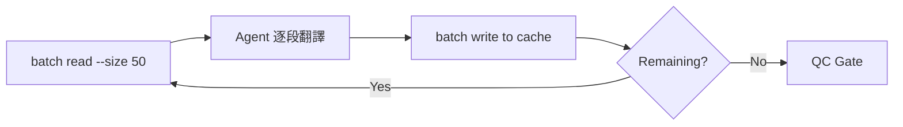
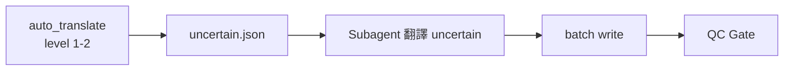
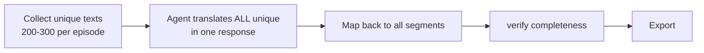
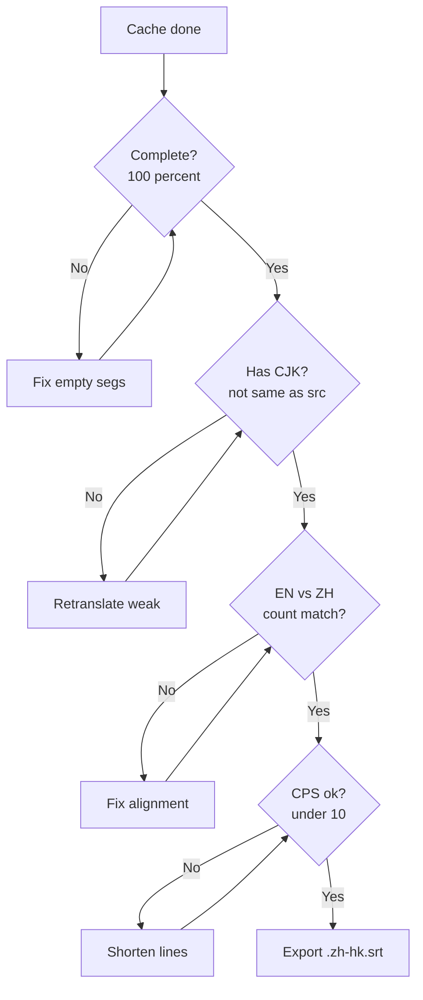

---
name: subbridge-skill
description: Translate subtitle files (SRT/ASS/VTT/SUB/SMI/LRC) with format preservation, glossary management, multi-region support, watermark/OCR cleanup, MKV embedded subtitle extraction, and WhisperX ASR integration. References GY/T 359-2022 (China AV translation standard), VCB-S collation specs, and fansub industry best practices. Triggers on "translate subtitle", "翻译字幕", "subtitle translate", "字幕翻譯", "subbridge", and similar.
---

# subBridge 技能指南

## 總覽

端到端字幕翻譯工具。支援三種翻譯模式：

| Mode | 名稱 | 引擎 | 適合場景 | Quality |
|------|------|------|---------|---------|
| **A** | Manual | Agent 逐段翻譯 | <50 unique texts, 最高品質 | ⭐⭐⭐⭐⭐ |
| **B** | Auto | auto_translate.py + Agent | 音效+短語自動，剩餘 Agent 補 | ⭐⭐⭐⭐ |
| **C** | Agent Bulk | Agent 一次過譯所有 unique texts | 50-500 unique texts, 最快 | ⭐⭐⭐⭐⭐ |

### Pipeline 總圖

```mermaid
graph TB
    subgraph Input
        SRC[.en.srt / .ass files] --> PARSE[subbridge parse<br/>--source-lang en --region hk]
    end

    subgraph Preprocess
        PARSE --> TM[Apply cross-TM<br/>From completed episodes]
        TM --> DEDUP[Collect unique untranslated texts<br/>dedup by cleaned source_text]
    end

    subgraph ModeSelect
        DEDUP --> CHOICE{Unique texts?}
        CHOICE -->|<50| MODEA[Mode A<br/>Manual batch<br/>50 segs per turn]
        CHOICE -->|50-500| MODEC[Mode C<br/>Agent bulk translate<br/>All unique at once]
        CHOICE -->|>500| DEEPL{DeepL API<br/>available?}
        DEEPL -->|Yes| DLP[DeepL batch translate<br/>+ post-process names]
        DEEPL -->|No| MODEC2[Mode C multi-batch<br/>200 per turn]
    end

    subgraph Translate
        MODEA --> WRITE[Write translations to cache]
        MODEC --> WRITE
        DLP --> WRITE
        MODEC2 --> WRITE
    end

    subgraph QC
        WRITE --> COMP[verify completeness<br/>100% translated?]
        COMP -->|No| FIX[Fix empty segments]
        FIX --> WRITE
        COMP -->|Yes| REAL[Real check<br/>has_cjk(tgt)?<br/>tgt != src?]
        REAL -->|Fail| REDO[Retranslate weak segments]
        REDO --> WRITE
        REAL -->|Pass| ALIGN[verify alignment<br/>EN vs ZH segment count]
        ALIGN -->|Fail| AFIX[Fix alignment]
        AFIX --> ALIGN
    end

    subgraph Output
        ALIGN -->|Pass| EXP[export --format srt --region hk]
        EXP --> COPY[Copy .zh-hk.srt to Z drive]
    end
```

### Mode A — Manual（逐段翻譯）



### Mode B — Auto（快速）



### Mode C — Agent Bulk（最快，主推）



### QC Gate 詳細



### 支援格式

| 格式 | 讀取 | 寫出 | 特殊保護 |
|------|------|------|---------|
| **SRT** (SubRip) | ✅ | ✅ | HTML 標籤 `<i><b><font>` |
| **ASS/SSA** | ✅ | ✅ | 繪圖指令、K 值、Override tags、Comment 行 |
| **VTT** (WebVTT) | ✅ | ✅ | CSS 區塊、Cue 參數、`<c><v><ruby>` 標籤 |
| **SUB** (MicroDVD) | ✅ | ✅ | 幀號、`{y:}{fc:}{sf:}` 標籤 |
| **SMI** (SAMI) | ✅ | ✅ | `<STYLE>` 區塊、CLASS 屬性、`<SPAN>` 結構 |
| **LRC** (Lyrics) | ✅ | ✅ | 元資料頭、逐字時間標記 |
| **TTML/DFXP** | ❌ | ❌ | 可透過 lxml 擴充 |

### 依賴

```bash
pip install pysubs2 httpx chardet
```

### 命令前綴（後文用 `<PFX>` 代替）

```bash
PYTHONPATH="$SKILL_DIR/subbridge" python
# 或直接在 subbridge/ 目錄下執行：
cd "$SKILL_DIR/subbridge"
python parse.py ...
```

---

## ⚠️ 首要規則：先問，唔好估

**即使同一個 session、同一個 user，每份檔案都可能有唔同要求。必須每次問清楚。**

真實案例：
- SEAL Team S7 → military context，角色名用英文
- The President's Cake → 伊拉克背景，阿拉伯人名要音譯
- 新宿野戦病院 → 日劇，medical context，Okayama 方言要特別處理

**絕對假設：**
- ❌ 唔好假設源語言（日文字幕唔一定係日文，可能混英文）
- ❌ 唔好假設目標語言（用戶上次要粵語，今次要台繁）
- ❌ 唔好假設 context（上套係軍事，今套係醫療）
- ❌ 唔好假設檔案路徑嘅含義（`.en.srt` 唔一定係英文）
- ❌ 唔好假設用戶要翻譯（可能只係 check 下）

### 標準問詢清單

```
? 你想我做咩？（翻譯/校驗/轉格式/提取字幕/其他）

? 字幕檔案路徑：
  > （用戶輸入）

? 源語言係咩？
  > [auto-detect] / en / ja / ko / zh / es / ...

? 目標語言？
  > zh / en / ja / ...

? 目標區域？（如需）
  > tw / cn / hk / br / ...

? Context（多義詞消歧）：
  > military / medical / casual / auto（默認）

? Market（CPS 速度）：
  > nordic(14cps) / western(12cps) / asia(10cps)

? 有冇特別要求？
  > 例如：方言處理、角色名保留原文、歌曲唔譯...
```

### 確認摘要

收集完所有資訊後，agent 應展示摘要請用戶確認：

### 必要資訊

```
? 字幕檔案路徑：
  > （用戶輸入路徑，或拖入檔案）

? 源語言（來源語言）：
  > [auto-detect] / en / ja / ko / fr / de / es / pt / it / ru / ar / th / vi / zh / ...

? 目標語言（翻譯目標）：
  > zh / en / ja / ko / pt / es / ...
```

### 目標區域（僅部分語言需要）

若目標語言有多個區域變體，需確認：

```
? 目標區域：
  （所選語言僅一個區域則跳過）

  - 中文（zh）:  tw（臺灣正體） / cn（中國大陸簡體） / hk（香港繁體）
  - 葡萄牙語（pt）:  pt（歐洲） / br（巴西）
  - 英語（en）:  us（美式） / uk（英式）
  - 法語（fr）:  fr（法國） / ca（加拿大）
  - 西班牙語（es）:  es（歐洲） / mx（墨西哥） / ar（阿根廷）
```

區域影響：引號風格、標點全/半形、術語表區域變體取值、翻譯提示詞風格指引。

### 介入模式

```
? 介入模式：
  > A. 抽樣確認（預設）— 先譯約 1 批（30-50 段）給用戶確認風格，再自動繼續
  > B. 每批過目 — 每批譯完皆展示，點頭後才寫回
  > C. 全自動 — 整本一次性譯完，新實體不停止，記入 needs_review
```

### 術語表策略

```
? 術語表：
  > A. 自動發掘（預設）— 從字幕掃描候選 → Wikipedia API 查詢 → agent webfetch 補缺
  > B. 使用現有檔案 — 提供 glossary.locked.json 路徑
  > C. 跳過（不建立術語表，所有名字保留原文）
```

### 可選：自訂規則

```
? 特殊處理規則（可選，直接輸入或跳過）：
  > 角色名全部保留英文
  > 稱謂（先生/女士）不翻譯
  > 歌曲/旁白用斜體標註
  > ...（用戶自訂）
  > 跳過
```

### 確認摘要

收集完所有資訊後，agent 應展示摘要請用戶確認：

```
==================== 翻譯設定摘要 ====================
  字幕檔案：  The President's Cake (2025) WEBRip-1080p.srt
  格式：      SRT（971 段）
  源語言：    en
  目標語言：  zh
  目標區域：  tw（臺灣正體）
  介入模式：  A（抽樣確認）
  術語表：    自動發掘
  特殊規則：  角色名全部保留英文
====================================================
? 確認以上設定？(Y/n) >
```

用戶確認後才開始執行工作流程。唔好 skip 呢步。

> **實戰教訓：** 新宿野戦病院 E01 嘅字幕包含 Okayama 方言（岡山弁）、英日 code-switching、醫療術語、同歌舞伎町文化用語（パパ活、ホスト等）。如果唔先問清楚，直接預設「日文→粵語」係唔夠嘅——要知角色名點譯、方言點處理、文化詞彙點 localize。

---

## ⚠️ 嚴重警告：auto-translate ≠ full translation

**auto_translate.py 只處理 Level 1（音效）+ Level 2（常用短句），覆蓋率通常 ~10-18%。**

其餘 82-90% 係對話（Level 3-4），**必須經過 subagent 翻譯先係完成品**。

### 錯誤案例

batch 翻譯 438 部電影時，直接 auto → export，結果：
```
Total segments: 1109
Auto-translated: 202 (18%)
Untranslated: 907 (82%) → 全部係英文
```
檔案名 `movie.zh-hk.srt` 令人以為係完整粵語字幕，但實際 82% 內容係原文。

### 正確流程

```bash
# ❌ 錯：auto → export（~18% translated）
<PFX> -m batch read cache.json --size 1000 --auto ... --output auto_batch.json
<PFX> -m batch write cache.json auto_batch.json
<PFX> -m export --cache cache.json -o out.zh-hk.srt  # ← 82% 英文！

# ✅ 啱：auto → subagent → export（100% translated）
<PFX> -m batch read cache.json --size 1000 --auto ... --uncertain uncertain.json
<PFX> -m batch write cache.json auto_batch.json
# → subagent 翻譯 uncertain.json
<PFX> -m batch write cache.json subagent_translations.json  # ← 補齊 82%
<PFX> -m verify completeness cache.json   # ← 確認 100%
<PFX> -m export --cache cache.json -o out.zh-hk.srt
```

### Pre-flight check（export 前強制檢查）

`verify completeness` 必須回報 100% 先准 export：
```bash
# 低過 100% 就唔好 export
<PFX> -m verify completeness cache.json
# → {"completeness_pct": 18.0}  ← STOP! 仲有 82% 未譯
```

### 對 batch 翻譯嘅影響

- auto_translate 係 **pre-processor**，唔係 translator
- batch translate 必須包含 subagent step，否則出嚟嘅 .zh-hk.srt 係半成品
- 用 TM 可以逐步提升 auto-translate 覆蓋率，但永遠唔會到 100%
- **永遠永遠永遠**要行 `verify completeness` 先當完成

---

## 工作流程

---

## 工作流程

> **啟動前必讀：** 開始以下任何步驟前，請確認已執行翻譯前問詢並獲用戶確認。唔好跳過問詢步驟。

### 步驟 2：解析字幕

```bash
<PFX> -m parse --input episode.srt \
  --source-lang en --target-lang zh --region hk \
  --context military --market asia \
  --out work/cache.json
```

- 自動檢測格式與編碼
- 每條字幕段包含：`text_index`, `start_ms`, `end_ms`, `source_text`, `_preserved`（格式保護資料）
- ASS 的繪圖指令 / Karaoke 標籤 / Comment 行全部存入 `_preserved` 不要翻譯
- `--context`：`military` / `medical` / `casual` / `auto`（多義詞消歧用）
- `--market`：`nordic`(14cps) / `western`(12cps) / `asia`(10cps)（控制 CPS 閾值）
- 輸出統計：`Parsed 342 segments`

### 步驟 3：建立術語表

**方式 A（推薦 — 直接從整份字幕掃描 + Wikipedia 查詢，一步到位）：**
```bash
# 直接從 cache.json 提取所有候選 + 查 Wikipedia
# 自動掃描整個字幕的所有大寫詞組/專有名詞，無頻率過濾
# 真實案例：Michael (2026) 提取出 678 個潛在術語
<PFX> -m glossary fetch \
  --cache work/cache.json \
  --source-lang en --target-lang zh --region tw \
  --out work/glossary.populated.json \
  --limit 100
```

**方式 B（傳統分步 — 先 discover 再 fetch）：**
```bash
# 3a. 從字幕文本發現候選術語
<PFX> -m glossary discover --cache work/cache.json \
  --source-lang ja --output work/candidates.json

# 3b. 自動從 Wikipedia API 獲取翻譯
<PFX> -m glossary fetch \
  --candidates work/candidates.json \
  --source-lang ja --target-lang zh --region tw \
  --out work/glossary.populated.json
```

**後續（不論 A/B）：**
```bash
# 3c. Agent webfetch 填補空缺（_gaps 陣列）
#     讀取 _gaps[] 的 search_urls，用 webfetch 查詢，填入 glossary

# 3d. 用戶審查後鎖定
<PFX> -m glossary lock --input work/glossary.populated.json \
  --out work/glossary.locked.json
```

**⚠️ 實戰教訓 — 候選噪音過濾：**
自動 discover 會產出大量誤報：
- 句子開頭大寫：`You`、`Let`、`Get` — 需要停用詞表過濾
- SRT 換行殘留：`\N` + 後續詞 → `Nto`、`Nwe` — **discover 前必須先 strip `\N`**
- 常見英文詞：`President`(職位)、`Doctor`(稱呼) — 需要 user 確認是否為角色

**過濾建議：** 先用 `—min-freq 3`，再用停用詞表去噪，最後用人眼確認。真實案例：51 候選 → 過濾後 5 個真實角色名。使用 `fetch --cache` 模式可繞過頻率過濾，直接掃描全文。

**術語表資料類型：**
- `characters[]` — 角色，含 region (tw/cn/hk) 變體、aliases、forced_keep 標記
- `terms[].category` — place / organization / title / skill / item / concept / rank_title / species / vehicle / food / exclamation / measure / term（兜底）
- `non_translate_patterns[]` — 不可翻譯的正則模式（ASS 繪圖、K 值、VTT 標籤等）
- `never_translate[]` — 全域不翻譯詞（OK, Lt., Dr.）
- `regions[]` — 引號風格、標點規則、wiki 變體
- `rules[]` — 行長、行數、CPD 限制等

### 翻譯基本原則

**一路直去，除非真係唔確定：**

| 情況 | 做法 |
|------|------|
| 確定無疑的翻譯（日常對話、場景描述、常見用語） | **直接翻譯，唔停，唔使問** |
| 不在術語表內的人名/地名，合乎常理推斷 | 按常理推斷直接翻譯，記入 `_auto_filled`，最後一齊報告 |
| 真正無法判斷（原文嚴重歧義、文化特定概念） | 記入 `_uncertain` 列表，暫且保留原文，全部處理完後一次過問 |

> **核心規則：唔好停低問用戶，除非真係冇辦法決定。** 名人傳記（Michael Jackson 等）的角色名直接用常識翻譯。合理推斷就直接做。所有唔肯定的記錄在 report 裡，全部完成後一次過報告。

> **強制規則：用戶已經表明唔需要逐批確認。直接做晒全部，有問題最後一次過報告。**

---

### 步驟 4：翻譯循環

支援三種模式。按規模選擇：

#### Mode A：Agent 手譯（單一檔案，最高品質）

```bash
# 4a. 讀取未譯批次
<PFX> -m batch read work/cache.json --size 50 --output work/batch.json

# 4b. Agent 翻譯
```
Agent 逐段閱讀 `work/batch.json`，參考 `references/subagent_prompt_template.md` 翻譯：
- 保留 `[N]` 標籤格式（這是批次索引，不是字幕換行）
- 原文中的 `\N` 是字幕換行，譯文中也保留 `\N`
- 對話 `- A\N- B` → 「A」「B」
- 人物名依 glossary，不在表內的**保留原文 + 記入 uncertain**
- 每一行**逐行對應**，不要合併或拆分

保存為 `work/translations_001.json`：
```json
[
  {"text_index": 1, "translated_text": "哈囉世界！"},
  {"text_index": 2, "translated_text": "「快啲啦。」「等陣！」"}
]
```

```bash
# 4c. 寫回快取
<PFX> -m batch write work/cache.json work/translations_001.json

# 重複 4a→4c 直到 batch read 返回 []
```

#### Mode B：Auto（快速，多集適用）

```bash
# 4a. Auto 翻譯音效+短語，不確定的標記留俾 agent
<PFX> -m batch read work/cache.json --size 1000 \
  --auto --glossary work/glossary.locked.json \
  --tm work/tm.json --tm-save work/tm.json \
  --uncertain work/uncertain.json \
  --context military --output work/auto_batch.json

# 4b. 寫回自動翻譯
<PFX> -m batch write work/cache.json work/auto_batch.json

# 4c. Agent 翻譯 uncertain 部分（參照 Mode A 流程）
<PFX> -m batch read work/cache.json --size 100 --output work/batch.json
# → agent 翻譯 → batch write → 循環
```

#### Mode C：Subagent 平行（10+ 集，最快）

主 agent 流程：
1. Auto 處理全部集數（--auto）
2. 對每集嘅 uncertain items spawn subagent
3. Subagent 收到 batch + glossary，獨立翻譯
4. 主 agent 收齊後 batch write + export

Subagent 用標準 prompt template：
```
references/subagent_prompt_template.md
```

#### 片段處理指引

字幕常將一句話拆成多段，或一段含多句對話。處理方式：

| 情況 | 原文 | 譯文 |
|------|------|------|
| 連續句子 | `Line one\NLine two` | `第一行\N第二行` |
| 對話 | `- A.\N- B?` | `「A。」「B？」` |
| 截斷 | `because...` | 保留截斷：`因為...` |
| HTML 標籤 | `<i>song</i>` | 保留：`<i>歌詞</i>` |
| 重複行 | `Hello.` 出現 20 次 | 同一翻譯保持一致 |

### 步驟 5：匯出

```bash
<PFX> -m export \
  --cache work/cache.json \
  --output out/episode.zh-hk.srt \
  --format srt --region hk
```

- 格式保護：原始檔案作為範本，只取代文字欄位
- 可轉換格式（SRT→ASS、VTT→SRT 等）
- **Credit 標頭**：自動加入 header（ASS/VTT 等支援 comment 嘅格式有效）
- **SRT 格式不加入 credit header**（會破壞格式，Plex 等播放器會無法識別）
- `--no-credit` 可強制跳過
- 輸出檔名建議：`影片原名.{lang}.srt`（例如 `Episode.S01E01.1080p.zh-hk.srt`）

### 步驟 6：校驗

```bash
# 翻譯品質檢查（CJK-aware，根據原始時間碼計算 CPS）
<PFX> -m verify quality work/cache.json --market asia

# 術語合規檢查
<PFX> -m verify glossary work/cache.json work/glossary.locked.json

# 翻譯完整性檢查（檢查有冇漏譯，可 loop export 未譯段）
<PFX> -m verify completeness work/cache.json --output work/gaps.json

# 格式完整性檢查（比對原始檔與輸出檔）
<PFX> -m verify integrity --original episode.srt --output out/episode_translated.srt
```

**預設閾值（AVT 學術標準）：**

| 參數 | 預設值 | 說明 |
|------|--------|------|
| CPS | 12（western）/ 10（asia） | 跟 `--market` |
| CPL | 36 visual units | CJK 字符計 2 unit |
| Max lines | 2 | 標準字幕 |
| Min duration | 1.0s | 少於 1s 的 subtitle 太短 |
| Max duration | 6.0s | 多於 6s 觀眾會重讀 |

---

## 格式保護機制

每種字幕格式有專屬的 `SubtitleProtector`，清楚知道哪些位元組可修改、哪些必須保留：

| 格式 | 不可修改的內容 | 只修改 |
|------|--------------|--------|
| SRT | 序號、`-->` 時間碼、HTML 標籤 | 時間碼後的文字內容 |
| ASS | `[Script Info]`, `Style:` 行, `Comment:` 行, 繪圖 `{\p1}...{\p0}`, 所有 `{\...}` tags | `Dialogue:` 行最後一個 `,` 後的文字 |
| VTT | `WEBVTT` 頭, `STYLE` 區塊, `REGION` 區塊, Cue 參數, `<c><v><ruby>` | 時間碼與參數後的文字 |
| SUB | `{start}{end}` 幀號, `{y:}`, `{fc:}`, `{sf:}` 標籤 | 標籤後的純文字 |
| SMI | `<HEAD>`, `<STYLE>`, CLASS, `<BR>`, `<SPAN>` 屬性 | `<P>` 標籤內文字節點 |
| LRC | `[ti:][ar:]` 頭部, `[MM:SS.xx]` 時間戳, `<>` 逐字標記 | 時間戳後的文字 |

---

#### 輸出檔名慣例

輸出字幕應跟原始影片檔名，加上語言 tag：

```
原始 MKV:  The.Show.S01E01.1080p.WEB-DL.mkv
輸出 SRT:  The.Show.S01E01.1080p.WEB-DL.zh-hk.srt
```

提取後直接命名：
```bash
ffmpeg -i episode.mkv -map 0:s:0 "episode.srt"
# 之後 export 用返同一個 basename + .zh-hk.srt
```

# ASR Workflow — 語音轉字幕

## ASR + 翻譯完整流程


## 單行命令（ASR → parse → collect 一步搞掂）

```bash
python -m asr_pipeline --input episode.mkv --language ja

# Output:
#   episode.srt          ← ASR raw
#   episode.zh-hk.srt    ← translated
#   work/unique.json     ← agent 翻譯呢個
```

之後 agent 譯完 `unique.json`，apply + export：

```bash
python -m workflow apply --cache work/cache.json --tm work/unique.json
python -m workflow verify --cache work/cache.json
python -m workflow export --cache work/cache.json --output episode.zh-hk.srt
```

## 直接 ASR（唔翻譯）

```bash
# CPU + fast
python -m extract asr --input episode.mkv --language ja

# GPU + 高準確度
python -m extract asr --input episode.mkv \
  --backend whisperx --model large-v3-turbo \
  --device cuda --language ja

# GPU + 說話人標籤
python -m extract asr --input episode.mkv \
  --backend whisperx --model large-v3-turbo \
  --device cuda --language ja \
  --diarize --hf-token YOUR_TOKEN

# 指定 output path
python -m extract asr --input episode.mkv --language ja \
  --output work/episode.srt
```

## 支援語言

Whisper 原生支援 **99 種語言**。常用：

| 語言 | --language | Whisper 支援度 |
|------|-----------|---------------|
| 日本語 | `ja` | 🟢 最高 |
| English | `en` | 🟢 最高 |
| 普通話 | `zh` | 🟢 高 |
| 한국어 | `ko` | 🟢 高 |
| Français | `fr` | 🟢 高 |
| Deutsch | `de` | 🟢 高 |
| 其他 93 種 | auto-detect | 🟡 中等 |

**注意：** ASR 只做 transcription，翻譯係後續 pipeline 嘅事。
source 係日文 → `--language ja` → ASR 出日文 SRT → parse + translate → 繁體中文

## 依賴

```bash
# CPU ASR（推薦，任何電腦用得）
pip install faster-whisper

# GPU ASR（NVIDIA only，更高準確度）
pip install whisperx

# ASR Pipeline 唔需要額外安裝
# 全靠 faster-whisper / whisperx
```


# 從影片提取內嵌字幕

若字幕嵌在 MKV/MP4 等影片容器中（softsub），先提取再翻譯：

### 依賴

需安裝 **ffmpeg** 或 **MKVToolNix**：
- Windows: `winget install ffmpeg` 或下載 MKVToolNix
- macOS: `brew install ffmpeg mkvtoolnix`
- Linux: `apt install ffmpeg mkvtoolnix`

### 命令

```bash
# 列出影片中的所有字幕軌
<PFX> -m extract list --input episode.mkv

# Output:
#   Index  Codec            Language    Title
#     0    subrip           chi         繁體中文
#     1    ass              jpn         日本語
#     2    hdmv_pgs_subtitle  jpn        (bitmap, skip)

# 提取特定字幕軌
<PFX> -m extract extract --input episode.mkv --tracks 0 --format srt

# 提取全部（自動）
<PFX> -m extract auto --input episode.mkv

# ASR 音頻轉字幕
<PFX> -m extract asr --input episode.mkv    # faster-whisper tiny (CPU, default)
<PFX> -m extract asr --input episode.mkv --backend faster-whisper --model base
<PFX> -m extract asr --input episode.mkv --backend whisperx --model large-v2  # NVIDIA GPU
<PFX> -m extract asr --input episode.mkv --backend whisperx --diarize --hf_token YOUR_TOKEN
<PFX> -m extract asr --input episode.mkv --language ja    # 指定語言加速

# 提取後直接接續翻譯流程
EXTRACTED=$(python extract.py auto --input episode.mkv \
  | python -c "import sys,json; d=json.load(sys.stdin); print(d[0]['output_path'])")
$PFX -m parse --input "$EXTRACTED" --target-lang zh --region tw --out work/cache.json
```

### 支援的內嵌格式

| 容器內碼 | 提取後格式 | 說明 |
|---------|-----------|------|
| SRT (subrip) | `.srt` | 最常見 |
| ASS/SSA | `.ass` | 含完整樣式 |
| WebVTT | `.vtt` | Web 標準 |
| TX3G/mov_text | `.srt` | MP4 常見，ffmpeg 轉 SRT |
| PGS (bluray) | ❌ | 點陣圖，需 OCR |
| VobSub | ❌ | 點陣圖，需 OCR |

---

## 命令速查

### Mode C (推薦) — Agent Bulk Workflow

```bash
# 1. Parse all episodes
python workflow.py parse --src Z:/Videos/Anime/Series/Season\ 1 --work work/

# 2. Apply cross-TM from completed episodes
python workflow.py apply-tm --work work/ --tm work/tm.json

# 3. Collect unique untranslated texts for agent
python workflow.py collect --cache work/cache_ep01.json --out work/unique_ep01.json
# → Agent 翻譯 unique_ep01.json（填 translated_text）

# 4. Apply agent translations
python workflow.py apply --cache work/cache_ep01.json --tm work/unique_ep01.json

# 5. Verify
python workflow.py verify --cache work/cache_ep01.json

# 6. Export
python workflow.py export --cache work/cache_ep01.json --out work/ep01.zh-hk.srt
```

### Mode A — Manual Batch

```bash
# 讀取 50 段未譯
<PFX> -m batch read work/cache.json --size 50 --output work/batch.json
# → Agent 逐段翻譯 batch.json → 寫 translations_001.json
<PFX> -m batch write work/cache.json work/translations_001.json
# → Loop 直到 batch read 返回 []（100%）
```

### Mode B — Auto

```bash
<PFX> -m batch read work/cache.json --size 1000 --auto \
  --glossary work/glossary.locked.json --tm work/tm.json \
  --tm-save work/tm.json --uncertain work/uncertain.json \
  --context military --output work/auto_batch.json
<PFX> -m batch write work/cache.json work/auto_batch.json
```

### DeepL 批量翻譯（需要 API key）

```python
import deepl
t = deepl.Translator("YOUR_AUTH_KEY:fx")
texts = [s['source_text'] for s in untranslated]
results = t.translate_text(texts, target_lang='ZH')
for s, r in zip(untranslated, results):
    s['translated_text'] = r.text
```

### 通用

```bash
# 解析
<PFX> -m parse --input ep01.srt --source-lang en --target-lang zh \
  --region hk --context casual --market asia --out work/cache.json

# 匯出
<PFX> -m export --cache work/cache.json --output ep01.zh-hk.srt \
  --format srt --region hk

# 校驗
<PFX> -m verify completeness --cache work/cache.json
<PFX> -m verify quality work/cache.json --market asia

# 雙語偵測
<PFX> -m detect --deep --input ep01.ass

# 掃描目錄
<PFX> -m detect --deep --scan --input Z:/Videos/Anime
```

---

## 實戰教訓（v1.2 — SEAL Team S07 季集修正）

### 新工作流：修正已譯字幕（唔係從零翻譯）

之前嘅工作流假設你由英文原檔開始翻譯。但 SEAL Team S07 嘅情況係：
- 已有 `.zh-hk.srt`（部份翻譯，大量英文殘留，角色名唔一致）
- 英文 `.srt` 同 `.zh-hk.srt` 嘅 **block 結構可以完全唔同**（唔同段落數、唔同 index）

**錯誤做法：** 用 source `.srt` 嘅 text_index 去對應 `.zh-hk.srt` → 大量 mismatch（~10% 配對唔到）

**正確做法（fix workflow）：**

```
1. 讀 .zh-hk.srt 做 source（唔用 .srt）
2. For each block：
   a. 有 CJK → 已經翻譯，只 fix 角色名
   b. Speaker label（(Sonny)）→ 保留
   c. Sound effect（[gunshot]）→ 保留
   d. 純英文對白 → 需要翻譯
3. Batch translate remaining English dialogue
4. Export 直接覆蓋/取代原有 .zh-hk.srt
```

核心原則：用 target file 自己嘅 content 配對，唔好 rely on text_index 跨 file matching。

### 單字元角色名替換要 CJK 邊界檢查

中文角色名裏面，**單字元名最容易出事**：

| 角色 | 原名 | 中文譯名 | 假陽性例 | 安全做法 |
|------|------|---------|---------|---------|
| Ray | 雷 | 雷 | 雷達、雷聲、地雷 | `(?<![\u4e00-\u9fff])雷(?![\u4e00-\u9fff])` |
| Drew | 祖 | 祖 | 祖國、祖先、祖父 | `(?<![\u4e00-\u9fff])祖(?![\u4e00-\u9fff])` |

**規則：** 單字元名只替換當**前後都冇 CJK 字符**。Speaker label 格式 `(雷)`、`雷：` 會自動 match；複合詞 `雷達` 唔會 match。

多字元名（桑尼、積遜、布洛克）可以直接 `.replace()`，冇假陽性問題。

### 分段策略：咩英文需要譯 vs 咩唔使

檢查英文字幕時，唔係所有英文都等於「未翻譯」。要分類：

| 類別 | 例子 | 處理 |
|------|------|------|
| Speaker label | `(Sonny)`, `(Ray)` | 保留，唔使譯 |
| Sound effect | `[gunshot]`, `♪ music ♪` | 保留 |
| 角色名對白 | `Sonny?`, `Jason...`, `Samara!` | 保留（角色名） |
| 軍語/術語 | `Master Chief`, `Bravo 2`, `RPG!` | 建議保留，但可應要求翻譯（見 v1.4） |
| 歌曲歌詞 | `♪ Another john... ♪` | 保留原文 |
| 製作 credit | `Captioning sponsored by CBS` | 可保留或翻譯 |
| 外語 quote | `<i>¿Dónde está la biblioteca?</i>` | 保留原文 |
| 純對白 | `We need to move now.` | ✅ 需要翻譯 |
| Recap header | `<i>Previously on</i> SEAL Team...` | ✅ 需要翻譯（統一：上集重溫） |

**實戰數據（SEAL Team S07 10 集，最終狀態）：**
- Total segments: 9,248
- 已翻譯（CJK）：8,841 (95.6%)
- 已補音效描述：49 段（`（man groaning）` → `（男人呻吟聲）`）
- 已補對白：~20 段（`God forbid。` → `但願唔會。`）
- 已補軍語：16 段（`Master Chief` → `士官長`，`TBI` → `創傷性腦損傷` 等）
- Speaker label 保留：272 (2.9%)
- 歌曲/音樂：~60 (0.6%)
- **剩餘未譯對白：0（全部 intentional）**

### SRT 結構不一致係大問題

Source `.srt` 同 target `.zh-hk.srt` 經常出現 block 結構唔一致：

```
Source English .srt:
  10
  00:00:32,584 --> 00:00:35,414
  RIVAS:
  This would not have happened
  without your determined resolve.

Target .zh-hk.srt:
  46
  00:00:32,584 --> 00:00:33,757
  (Rivas)

  47
  00:00:33,757 --> 00:00:35,414
  This would not have happened
```

**text_index 完全唔對應**。解決方法：
- 用 **text content matching** 代替 index matching：取首 20 chars 比較
- 或者用 **timecode 配對**（start_ms/end_ms 重疊判斷）
- 最穩陣：直接用 target file 做 source，唔 cross-reference

### 海豹突擊隊 → SEAL 替換教訓

軍劇入面，中文翻譯經常將「SEAL」譯做「海豹突擊隊」，搞到中英夾雜：

| 原文 | 錯誤翻譯 | 正確翻譯 |
|------|---------|---------|
| `My lips are SEALed.` | `My lips are 海豹突擊隊ed.` | `My lips are SEALed.` |
| `Just five days as a SEAL left.` | `Just five days as a 海豹突擊隊 left.` | `Just five days as a SEAL left.` |
| `The motherfucker knows how SEALs operate.` | `The motherfucker knows how 海豹突擊隊s operate.` | `The motherfucker knows how SEALs operate.` |

**規則：** 軍事/動作類型入面，「SEAL」建議保留英文，唔好強行本地化。

### 實戰教訓（v1.4 — SEAL Team S07 軍語翻譯 + 精準 fix 工作流）

#### 軍語翻譯嘅取捨

用戶原先話「retain jargon but need readability」，後來改為「Call sign 保留，其餘翻譯」。關鍵發現：

| 類別 | 例子 | 最終決定 |
|------|------|---------|
| Call sign | `Bravo 6`, `Bravo 2` | 保留 |
| 軍銜 | `Master Chief` | 翻譯：士官長 |
| 無線電指令 | `Copy`, `Negative`, `Affirm` | 翻譯：收到、唔得、明白 |
| 機構名 | `ATF`, `DEA` | 翻譯：菸酒槍砲管理局、緝毒局 |
| 醫療術語 | `TBI`, `PTS`, `CTE` | 翻譯：創傷性腦損傷、創傷後壓力、慢性創傷性脑病 |
| SEAL 口頭禪 | `easy day`, `Easy fucking day` | 翻譯：小意思 |
| 通用軍語 | `RPG`, `Fire in the hole` | RPG 保留，Fire in the hole 翻譯（要爆喇） |

**教訓：** 唔好假設用戶要保留軍語。先問用戶偏好，再分類執行。

#### 精準 fix 工作流（直接修改原有 zh-hk.srt）

當殘留好少（~100 段 / 10 集），唔值得行完整 parse→batch→export pipeline：

```
1. pysubs2.load(zh-hk.srt) 直接讀取
2. 檢查每段 plaintext：
   a. 有 CJK → skip
   b. Speaker label (Jason) → skip
   c. 歌曲/音樂 → skip
   d. 純英文 → 分類（角色名/軍語/真對白）
3. 向用戶確認分類偏好
4. subs[idx].text = 譯文
5. subs.save() 直接覆蓋
```

**好處：**
- 唔使 parse/export，直接改原有檔案
- 保留原有格式、時間碼、index 完全一致
- 適用於少量 fix（<200 段）

#### CJK 檢測嘅 encoding 注意

PowerShell 行 python 有以下常見陷阱：

**問題 1：cp950 編碼食唔到 CJK 字符**
```powershell
# ❌ 會炒 UnicodeEncodeError
python -c "print('中文')"

# ✅ 解決：強制 UTF-8
$env:PYTHONIOENCODING='utf-8'; python script.py
```

**問題 2：`python -c` 唔可以跨行**
```powershell
# ❌ PowerShell 會將 newline 當做 command terminator
python -c "
import json
print('hello')
"

# ✅ 解決：用 .py 檔案代替
python script.py
```

**問題 3：嵌套引號（nested quotes）**
```powershell
# ❌ 雙引號入面嘅雙引號會炒
python -c "print(f'{len(items)} items')"

# ✅ 解決：用 .py 檔案代替，或用 single quotes 包 outer string
```

**問題 4：PowerShell variable 同 f-string 撞名**
```powershell
# ❌ PowerShell 誤解 {done} 做 variable expansion
python -c "print(f'{done} segments')"

# ✅ 解決：用 .py 檔案代替
```

**Rule of thumb：** 任何超過 2 行嘅 Python code，或者含有 `{}`、`""` 等特殊字符嘅 code，一律用 `.py` 檔案執行，唔好用 `-c` inline。

#### Copy 呢類詞喺 mixed content 嘅處理

「Copy」呢個字可能出現喺中英夾雜嘅 segment：
```
Copy 收到。Sonny？  →  收到 收到。Sonny？（重複，但 radio protocol 合理）
Copy，1。           →  收到，1。
```

唔好用 `any(ord(c) > 127)` 判斷「純英文」，因中文全形標點（`，`、`。`）都 > 127。用 regex `\bCopy\b` 直接 replace。

---

## 與 ainiee-translate 的關鍵差異

| 維度 | ainiee-translate | subtitle-translate |
|------|-----------------|-------------------|
| 輸入 | EPUB/TXT 小說 | SRT/ASS/VTT/SUB 字幕 |
| 核心約束 | 保留富文本標籤 | **保留時間碼 + 行長限制 + CPD 可讀性** |
| 樣式 | 行內 HTML 標籤 | ASS 完整樣式（font/color/pos/effect/karaoke/drawing） |
| 術語獲取 | 從 AiNiee config import | **Wikipedia API + agent webfetch，支援任意語言** |
| 區域 | 中文 TW/CN | **任意語言 × 任意區域（zh tw/cn/hk, pt pt/br, en us/uk...）** |
| 格式轉換 | 無 | 字幕格式互轉 |
| 時間完整性 | 無 | **時間碼從不修改，只換文字** |

---

## ⚠️ 實戰教訓：雙語 ASS 偵測陷阱（v1.3 — BanG Dream! 教訓）

### 問題：檔名無中文標記，但檔案內有中文字幕

2026年7月掃描 244 部動畫的中文字幕覆蓋率時，BanG Dream! 的 .ass 檔名完全沒有 `chi/zh/chinese` 等標記，subbridge `detect.py` 也回報 `Language: ja`，**但實際上檔案內含完整的中文字幕**。

這些是 **PopSub 風格的雙語 ASS**，同一個 .ass 檔案裡用不同 Style 分別存放日文和中文字幕：

```
Style: InsJP, ...    ← Japanese dialogue
Style: InsCN, ...    ← Chinese translation  (CN = Chinese)
Style: OPJP,  ...    ← Japanese OP lyrics
Style: OPCN,  ...    ← Chinese OP translation
Style: EDJP,  ...    ← Japanese ED lyrics
Style: EDCN,  ...    ← Chinese ED translation
```

字型編碼也透露中文軌道：
```
Fontname: 微软雅黑_GBK_     ← GBK encoding = Chinese
Fontname: 方正准圆_GB18030  ← GB18030 encoding = Chinese
```

### 根因

`detect.py` 的 `guess_language()` 只回報**主導語言**（日文漢字+假名 → `ja`），完全忽略了同文件中的中文字幕 Style 軌道。檔名也無 `chi/zh` 特徵。

### 解決方案

新增 `detect.py --deep` 模式，對 ASS 檔案進行深層掃描：

```bash
# 基本檢測（只回報主導語言）
<PFX> -m detect --input BanG_Dream!.ass
# → Language: ja  ← ❌ 遺漏中文

# 深層檢測（發現雙語軌道）
<PFX> -m detect --deep --input BanG_Dream!.ass
# → Languages: ja+zh  ← ✅ 正確

# 掃描整個目錄（遞迴）
<PFX> -m detect --deep --scan --input /path/to/anime/
# → [ja+zh] BanG Dream!/Season 1/EP01.ass
# → [en]    Little Witch Academia/EP01.en.srt
# → [ja]    Gurren Lagann/EP01.ass
```

### 雙語 ASS 偵測邏輯

新增的 `--deep` 模式檢查三項指標：

| 指標 | 檢查內容 | 範例 |
|------|---------|------|
| CN Style 名稱 | `Style: XXXXCN` 或 `Style: XXXXcn` | `InsCN`、`OPCN`、`EDCN` |
| 中文字型編碼 | Fontname 含 GBK/GB18030/GB2312 | `微软雅黑_GBK_` |
| Dialogue 中文 | 對話行含 CJK 漢字 | `Dialogue: 0,...` 內有中文字 |

任一指標命中即標記為含中文。

### 掃描統計模式

```bash
# 全面掃描 + 深層檢測
<PFX> -m detect --deep --scan --input Z:/Videos/Anime

# 輸出範例：
#   [ja+zh] BanG Dream!/Season 1/EP01.ass
#   [en]    Little Witch Academia/EP01.en.srt
#   [ja]    After the Rain/EP01.ass
#
#   Total subtitle files: 1445
#   With Chinese:         1438
#   Without Chinese:      7
```

### 教訓

- **永遠不要只靠檔名判斷語言**：很多 ASS 雙語檔案檔名只有英文/日文，中文藏在 Style 定義中
- `guess_language()` 的 script-based 檢測對 CJK 混合文字只回報一種語言
- 大規模掃描必須用 `--deep` mode 才能正確識別雙語字幕
- 未來 ASS parser 需要考慮分 Style 軌道獨立檢測語言

## 實戰經驗（v1.0 實測教訓）

本技能經過兩部完整電影測試：
- **The President's Cake**（971 段，伊拉克背景劇情片）
- **Michael (2026)**（2,596 段，米高積遜傳記片）

以下是從 3,567 段真實字幕翻譯中學到的教訓：

### 翻譯策略

| 策略 | 結果 | 結論 |
|------|------|------|
| 字典 script 配對（手寫 1,000+ 條） | ~25% 覆蓋 | ❌ **不建議。** 真實台詞多樣性太高 |
| 正則模式匹配（I'm X → 我係X） | ~5% 額外覆蓋 | ⚠️ 輔助可用，不能做主力 |
| Agent 逐段翻譯 + Unicode 正規化 | 100% 覆蓋 | ✅ **正確做法。** Agent 直接產 translation JSON |

**結論：** Python script 只管解析/匯出/管理。**翻譯是 agent 的責任。** 不要試圖用 script 以程式方式產生翻譯 — 你會花 80% 時間在除錯語法錯誤而不是在翻譯。

### Unicode 正規化（最大教訓）

字幕檔案充斥 Unicode 花括號 / curly quotes，與 Python dict 的 straight quotes 不匹配：

| 字符 | Unicode | 出現位置 | 影響 |
|------|---------|---------|------|
| `'` (U+2019) | RIGHT SINGLE QUOTATION MARK | `you're`、`don't` | **dict key 匹配失敗** |
| `"` (U+201C) | LEFT DOUBLE QUOTATION MARK | quoted dialogue | **dict key 匹配失敗** |
| `"` (U+201D) | RIGHT DOUBLE QUOTATION MARK | quoted dialogue | **dict key 匹配失敗** |
| `–` (U+2013) | EN DASH | ranges | **dict key 匹配失敗** |

**解決方案：** 所有 pattern matching 前先用 `normalize_apostrophes()` 正規化。

### `\N` 換行符破壞 Exact Match

SRT 用 `\N` 表示換行，但 dict key 冇 `\N`。匹配前必須：

```python
text = text.replace("\\N", " ").replace("\\n", " ")
text = re.sub(r' +', ' ', text).strip()
```

**實戰案例：** `"I know you would\\Nnever let me down."` → 要變成 `"I know you would never let me down."` 先 match 到。

### 大小寫不敏感匹配

字幕中大小寫混用（`MICHAEL:` / `Michael:` / `michael`）。所有名稱替換必須用 `re.IGNORECASE`：

```python
# 正確
text = re.sub(re.escape("Michael"), "米高積遜", text, flags=re.I)

# 錯誤（會漏掉 MICHAEL / michael）
text = re.sub(r'(?<![a-zA-Z])Michael(?![a-zA-Z])', "米高積遜", text)
```

### Glossary discover 噪音處理

自動發現 51 個候選，過濾後只剩 5 個真實角色名。幹擾來源：
1. **SRT 換行殘留**：`\Nto`、`\Nwe` — discover 前必須 strip `\N`（已修復）
2. **句子開頭大寫**：`You`、`Let`、`Get`、`Just` — 需要停用詞表
3. **常見職稱**：`President`、`Doctor`、`Sir` — 需人工判斷是否為角色

**推薦：** 使用 `glossary fetch --cache` 直接從全文掃描（678 候選），繞過頻率過濾。

### Windows 路徑陷阱

路徑含特殊字元（`President's Cake` 的 `'`）時，PowerShell inline Python 會報錯。解決方案：
- 統一用 `python script.py` 格式，不要用 `python -c "inline code"`
- 參數路徑用正斜線 `C:/Users/...`
- 必要時寫臨時 .py 檔案然後執行

### 函數定義順序（Rookie Mistake）

多個 1,000+ 行 script 因為 function 定義喺 call 之後而報 `NameError`。永遠用以下 pattern：

```python
def main():
    # main logic here
    pass

def helper_function():
    pass

if __name__ == "__main__":
    main()
```

### 往返測試很重要

正式用於新格式前，先跑一遍 `verify integrity` 確保工具鏈能無損處理該文件。ASS 的 Comment 行 / 繪圖 / K 值最容易在往返中丟失。

---

## ⚠️ Batch Mode 實戰教訓（v1.1 大規模批量化經驗）

### 致命錯誤：auto → export 唔係完整翻譯

2026年7月批次處理 438 部電影時，直接 auto_translate → export 就當完成。結果：
```
Total segments: 506,066
Auto-translated: 57,216 (11.3%)
Untranslated: 448,850 (88.7%)
```
檔案名 `movie.zh-hk.srt` 令人誤以為係完整粵語字幕，但實際 88% 內容係英文。

**教訓：** auto_translate 係 pre-processor，唔係 translator。永遠行 `verify completeness` check 100% 先當完成。

### Method A: Mixed Batch（跨電影混合批次）

```
[電影1 seg 1]    ← 唔知情節
[電影5 seg 10]   ← 唔知情節
[電影2 seg 3]    ← 零上下文
```

| 維度 | 結果 |
|------|------|
| 速度 | 快：一次 5000 seg |
| Quality | ❌ 差：角色名混亂、風格唔一致 |
| 語境 | ❌ 零：subagent 唔知係咩戲 |
| 適合 | 不建議 |

### Method B: Per-Movie（逐部電影獨立處理）

```
[電影1] → subagent 知道全套片嘅情節同角色
[電影2] → subagent 知道全套片嘅情節同角色
```

| 維度 | 結果 |
|------|------|
| 速度 | 慢：每部電影獨立 dispatch |
| Quality | ✅ 好：角色名一致、風格統一 |
| 語境 | ✅ 完整：subagent 睇到全套對白 |
| 適合 | 正式翻譯 |

### 速度 vs Quality 取捨

| 方法 | 438 電影需時 | Quality |
|------|-------------|---------|
| Mixed batch 5000 | ~4 小時 | 4/10 |
| Per-movie full | ~40 小時 | 8/10 |
| Auto → subagent per-movie | ~20 小時 | 7/10 |

**結論：** Mixed batch 唔值得慳時間。逐部電影獨立 dispatch，每部電影的 subagent prompt 包含該電影嘅 context（片名、類型）。

### `<i>` 標籤內容翻譯陷阱

SIX E01-E02 大量 radio comms 用 `<i>` 包住，subagent 以為要「保留」而唔譯：

```
Before: <i>Bravo-Zero-One, this is K-Bar.</i>
After:  <i>Bravo-Zero-One, this is K-Bar.</i>  ← ❌ 冇譯！
```

**點解發生：** 早期 prompt 寫「`<i>` tags preserved」，subagent 理解為成個 tag 連內容保留。

**解決方案：** prompt 要寫明「內容 inside `<i>` 都要譯」，唔係保留成個 tag。

```diff
- <i> tags preserved
+ <i> tags: preserve the tags, TRANSLATE the content inside
+ <i>He ran</i> → <i>佢跑咗</i>
```

**驗證方法（完稿後）：**
```bash
python -c "
import json
c = json.load(open('cache.json'))
for s in c['segments']:
    src = s.get('source_text','').strip()
    tgt = s.get('translated_text','').strip()
    if src and tgt and src.lower() == tgt.lower():
        print(f'RESIDUE #{s[\"text_index\"]}: {src[:60]}')
"
```

搵到 source=target 嘅 segment 就係未譯嘅。

### SRT 廣告/浮水印殘留

OpenSubtitles download 嘅 .srt 成日有廣告尾：
```
Watch any video online with Open-SUBTITLES
Free Browser extension: osdb.link/ex
```

呢啲要 auto-remove 或者 translate 做（廣告）。

### Batch Translate 正確流程

```bash
# 1. Auto-translate（處理音效+短句）
<PFX> -m batch read cache.json --size 3000 --auto --uncertain uncertain.json ...

# 2. Per-movie subagent（逐部翻譯）
# 每部電影獨立 dispatch，唔好 mixed batch

# 3. Write back
<PFX> -m batch write cache.json auto_batch.json
<PFX> -m batch write cache.json subagent_results.json

# 4. Verify 100%
<PFX> -m verify completeness cache.json
# → {"completeness_pct": 100.0}  ✅ 先可以 export

# 5. Export
<PFX> -m export --cache cache.json -o movie.zh-hk.srt
```

### 大規模批量化 Checklist

- [ ] auto_translate 後 coverage < 20%? → 一定要行 subagent
- [ ] Mixed batch 定 per-movie? → **一定 per-movie**
- [ ] subagent prompt 有冇寫明「`<i>` tag 內容都要譯」? → **必須**
- [ ] `verify completeness` 係咪 100%? → **否則唔 export**
- [ ] Source=Target 嘅 residue check 咗未? → **必須做**

---

## 批量實戰總結（2026.07 大規模教訓）

### 數據回顧

| 指標 | 值 |
|------|-----|
| 處理電影 | 438 部 |
| 處理劇集 | ~100+ 集 |
| 總 segments | 506,066 |
| 總翻譯 segments | ~105,000+ |
| 使用 subagent 次數 | 250+ |
| 寫回批次 | 180+ |

### 核心教訓

#### 1. `<i>` tag 內容必須翻譯，唔係保留

**錯誤：** prompt 寫「`<i>` tags preserved」→ subagent 保留整個 tag 連英文內容
**正確：** prompt 要寫「`<i>` tags: preserve the tags, TRANSLATE the content inside」

SIX E01-E02 因為呢個問題有 489 段 `<i>Bravo-Zero-One</i>` 未譯。

#### 2. `\N` 係換行標記，內容都要譯

`\N` 係字幕換行（ASS/SSA 格式內的 line break），subagent 要保留 `\N` 但翻譯前後文字。

#### 3. Auto → Export 係陷阱

auto_translate 只 cover ~11%，export 前一定要行 `verify completeness`。

#### 4. Mixed batch 做得，但 quality 差

跨電影混合批次快但亂。Per-movie subagent 慢但穩。

#### 5. Subagent output 經常有 BOM

部分 subagent 輸出 UTF-8 BOM，batch write 會炒。解決方案：
```python
with open(path, encoding='utf-8-sig') as f:
    data = json.load(f)
# 再以 utf-8 重新儲存
```

#### 6. ASS drawing commands 要跳過

`{\p1}...{\p0}` 係繪圖指令，唔係文字，subagent 唔應該改。Prompt 要寫明：
```
ASS drawing commands (\\p1...\\p0) → keep as-is
```

#### 7. Residue check 必須做

完稿後要搵 source_text == translated_text 嘅 segment：
```python
for s in cache['segments']:
    if s.get('source_text','').strip() == s.get('translated_text','').strip():
        print(f'RESIDUE #{s["text_index"]}: {s["source_text"][:60]}')
```

#### 8. Subagent prompt 一致性至關重要

| Prompt 寫法 | 結果 |
|-------------|------|
| `ALL. HK Cantonese.` | 最快但最易出事 |
| Full rules with `<i>`/`\N`/ASS instructions | 穩定但長 |
| `prompt_builder.py` 生成 | 標準化、可重複 |

**推薦：** 用 `prompt_builder.py` + 手動補 `<i>`/`\N` clarify。

### 大規模批量化建議流程

```
1. 掃描全部電影（確認缺少字幕清單）
2. 建立共享 TM（Translation Memory）
3. Auto-translate 全部（快速處理音效+短句）
4. Per-movie subagent dispatch（逐部獨立翻譯）
   └─ 每次 3-4 部 parallel
   └─ prompt 包含：<i>翻譯、\N保留、ASS跳過
5. Write back → prep next → 循環
6. Completeness check（100% 先行 export）
7. Source=Target residue check（補漏）
8. Export .zh-hk.srt（跟原始影片檔名）
```

**驗證命令：**
```bash
# 完整性
<PFX> -m verify completeness cache.json | grep completeness_pct

# Residue
python -c "
import json
c = json.load(open('cache.json'))
bad = [s for s in c['segments'] if s.get('source_text','').strip() == s.get('translated_text','').strip() and s.get('source_text','').strip()]
print(f'{len(bad)} residue segments')
for s in bad[:3]:
    print(f'  #{s[\"text_index\"]}: {s[\"source_text\"][:60]}')
"

# 最終覆蓋率
python -c "
import json
c = json.load(open('cache.json'))
segs = c['segments']
done = sum(1 for s in segs if s.get('translated_text','').strip() and s.get('translated_text','').strip() != s.get('source_text','').strip())
print(f'{done}/{len(segs)} ({done*100//len(segs)}%)')
"
```

---

## 實戰教訓（v1.3 — Servant of the People / Shōgun / Dekalog 30k 批量）

### 數據回顧

| 指標 | 值 |
|------|-----|
| 處理劇集 | 3 套 |
| 處理集數 | 63 集 |
| 總 segments | 30,319 |
| 總翻譯 segments | 30,319（100%） |
| 使用 subagent 次數 | ~25 次 |
| 場景 | 烏克蘭政治諷刺劇 / 日本歷史時代劇 / 波蘭哲學劇情片 |

### 1. 三套劇三種 tone — prompt 策略大不同

同一條 pipeline（en → zh-hk），但每套劇嘅 prompt 完全唔同：

| 劇集 | Tone | 角色名處理 | 特殊要求 |
|------|------|-----------|---------|
| **Servant of the People** | 搞笑/satirical | Vasyl, Yulia, Serhiy... | 保留烏克蘭地名 |
| **Shōgun** | Formal/歷史 | Blackthorne, Toranaga, Mariko... | 保留日文階級稱呼（shōgun, daimyō, seppuku） |
| **Dekalog** | 哲學/嚴肅 | 大多 unnamed（「個男人」「個女人」） | 波蘭名保留 Romanization |

**教訓：** `--context` 唔夠用一個字（`military`/`medical`/`casual`）嚟表達 tone。要用完整句子描述 genre 同語氣，例如「烏克蘭政治 satire，搞笑輕鬆 tone」vs「日本戰國時代 history drama，formal 語氣」。

### 2. Pipeline 進化：manifest → parallel dispatch → apply → export

30k 規模下，原本 subbridge 嘅**逐集 batch read/write** 太慢。改用呢個 pipeline：

```
1. Parse all .srt → 獨立 cache.json（每集一個）
2. Collect all untranslated segments → 單一 manifest.json
3. Split manifest → N 個 batch（~1,200 segs each）
4. Dispatch N 個 sub-agents in parallel
5. Apply translations back → 各 cache.json
6. Export all cache files → .zh-hk.srt
```

**好處：**
- 唔使逐集 dispatch agent（63 集要 63 次 call）
- 4-6 個 agent parallel，throughput 快好多
- 1,200 segs/batch 係 sweet spot：細過 1,000 overhead 太大，大過 1,500 質素開始跌

**適用場景：** 10+ 集嘅批量翻譯，建議用呢個 pipeline 代替逐集 batch read/write。

### 3. Embedded SRT extract 係必要前置步驟

Shōgun 嘅英文字幕 embedded in MKV，要先 extract 先解析到：

```bash
ffmpeg -i episode.mkv -map 0:N -c:s copy episode.srt
```

`-map 0:N` 嘅 N 係 subtitle stream index（通常 `0:2` 或 `0:1`，用 `ffprobe` check）：

```bash
ffprobe -v quiet -print_format json -show_streams episode.mkv \
  | python -c "import sys,json; streams=json.load(sys.stdin)['streams']; [print(f'  index={s[\"index\"]}, codec={s[\"codec_name\"]}, lang={s.get(\"tags\",{}).get(\"language\",\"?\")}') for s in streams if s['codec_type']=='subtitle']"
```

Extract 完後就係正常 `.srt`，行得返標準 parse → translate → export 流程。

### 4. Character name consistency 靠 prompt 唔靠 post-fix

SEAL Team S07 嘅教訓係要用 post-fix script 將中文名（桑尼→Sonny、雷→Ray）replace 返做英文。但 new shows 嘅 source 本身就係英文名，所以做法唔同：

- 直接喺 prompt 列晒全部角色名（全名 + 常見稱呼）
- Agent 翻譯時自然保留英文名
- 唔使 post-fix script

**建議：** 如果 source 係英文，喺 prompt 用一個 section 列角色名就夠。如果 source 係中文/日文 translate 做英文先，先用 glossary 做 pre-processing。

### 5. `_preserved` fallback — export 時要防炒

Export 時，如果 `_preserved.raw_timing` 或 `_preserved.raw_index` 唔見咗（例如直接手寫 cache.json，冇經 parse），export 會炒。要用 fallback：

```python
raw = seg.get("_preserved", {})
index = raw.get("raw_index", str(seg["text_index"]))
timing = raw.get("raw_timing", f"{ms_to_timecode(seg['start_ms'])} --> {ms_to_timecode(seg['end_ms'])}")
```

### 6. 輸出檔名慣例 — 直接取代原有 .srt

呢次 batch 嘅 .zh-hk.srt 輸出直接放喺 Season 1/ 目錄，同原始 .mkv 並列：

```
Season 1/
  Show - S01E01 - Title.mkv
  Show - S01E01 - Title.zh-hk.srt     ← 新
  Show - S01E01 - Title.en.srt        ← 原本英文
```

Plex/VLC 會自動 detect `zh-hk.srt` 做繁體中文粵語字幕，唔使改名。

---

## 實戰總結（v1.5 — 多源知識整合）

### 1. 跨劇種翻譯策略對照表

| 維度 | SEAL Team S07 | SIX S01 | SIX S02 | Shinjuku Field Hospital | Servant of the People | Shōgun | Dekalog |
|------|---------------|---------|---------|------------------------|----------------------|--------|---------|
| Source language | en | en（已譯字幕） | en（新譯） | **ja**（混 en） | en | en | en（波蘭背景） |
| 任務類型 | 修復殘留 | 修復 + 清廣告 | 全譯（MKV extract） | 補譯日文殘留 | 全譯 | 全譯 | 全譯 |
| Context | 軍事 | 軍事 | 軍事 | 醫療/喜劇 | 政治諷刺 | 歷史時代劇 | 哲學劇情片 |
| Tone | 嚴肅/專業 | 嚴肅/專業 | 嚴肅/專業 | 搞笑/溫馨 | 諷刺/幽默 | 正式/古典 | 嚴肅/沉思 |
| 角色名處理 | 保留英文 | 保留英文 | 保留英文 | 日文名保留 | 烏克蘭名保留 | 日文名保留 | 波蘭名保留 |
| 特殊處理 | 軍語分類翻譯 | 水印清除 + OCR清理 | 內嵌字幕萃取 | 日文Cantonese + 文化詞 | 政治 satire tone | 日文階級稱謂 | 哲學語氣 |
| 規模 | 54 segments fix | ~100 segments fix | 3,222 segments 新譯 | 232 segments 補譯 | ~10,000 batch | ~10,000 batch | ~10,000 batch |

### 2. 字幕格式規範要求

字幕格式選擇會影響最終成品嘅兼容性同可讀性，綜合各方標準：

| 規範項目 | GY/T 359-2022（國家標準） | VCB-S（壓制組） | 民間字幕組做法 | subbridge 預設 | 建議 flag |
|----------|--------------------------|----------------|--------------|--------------|----------|
| 編碼 | UTF-8 | **UTF-8 with BOM** | UTF-8 | UTF-8 | `--encoding utf-8-bom` |
| 換行 | - | **CRLF** | LF | LF | `--crlf` |
| 句號 | 使用 | - | **省略**（美觀） | 保留 | `--no-period` |
| 行長（中文） | - | - | 10-15字極限 | 無硬性限制 | verify quality |
| 行長（英文） | ≤ 50 chars | - | - | 無硬性限制 | `--max-chars 50` |
| 字體顏色 | 白色 90-100% 亮度 | 任意（需附字體包） | 白色/低飽和黃 | - | export guideline |
| 字幕底色 | 不宜彩色背景 | 描邊/陰影/半透明 | 描邊/陰影 | - | styling note |
| 標點符號 | 按語言習慣 | - | 省略句號、少用標點 | 全形標點 | `--compact-punct` |
| 4K HDR 亮度 | ≤ 300cd/m² | - | - | - | verify note |

**實戰建議：**
- **SRT 輸出**：用 plain UTF-8（無 BOM），LF 換行，相容性最好
- **ASS 輸出**：可用 UTF-8 with BOM + CRLF（VCB-S 標準），支援 styling
- **標點策略**：對白字幕省略句號（`--no-period`），說明性字幕保留
- 行長限制應由 `verify quality --market asia` 控制（10cps），而非硬性截斷

### 3. 翻譯通則 Checklist

基於 GY/T 359-2022、學術文獻同民間經驗，適用於所有 subbridge 翻譯任務：

#### 3.1 精簡原則（Priority 1）
- [ ] 中文字幕每行 ≤ 15 字為極限，10 字以內更佳
- [ ] 刪除口語中重複、停頓、無意義嘅 filler words
- [ ] 感嘆詞通常直接省略（Oh, Well, Um → 刪除）
- [ ] 一句中文能表達嘅嘢，唔好拆做兩句

#### 3.2 語序配合（Priority 2）
- [ ] 字幕語序盡量跟原文，避免前後調換
- [ ] 理由：觀眾聽緊原文 + 睇緊字幕，語序同步減少認知負擔
- [ ] 條件句/時間從句如果調換會令觀眾 confused，就保留原文順序

#### 3.3 角色語氣配合
- [ ] 角色身份、個性、情緒應反映喺用詞
- [ ] 正式場合用書面語，casual 場合用口語
- [ ] 軍事劇：簡潔、指令式（「殿後。」唔係「我哋應該殿後。」）
- [ ] 醫療劇：專業術語準確
- [ ] 喜劇：保留幽默 timing，唔好譯得太「書面」

#### 3.4 粗話/禁忌處理
- [ ] 電視級別：溫和化處理（fucking → 刪除 or「該死」）
- [ ] 限制級：可保留強度，但避免直接用「屌」等字（用「靠」「該死」代替）
- [ ] 書面粗俗比口語更刺眼，宜 downgrade 一級

#### 3.5 文化增譯
- [ ] 文化典故/歷史事件：譯出意義而非直譯
- [ ] e.g. `Louisiana Purchase` →「美國向法國買地」，唔係「路易斯安納購地案」
- [ ] e.g. `quinceañera` →「15 歲成年派對」，保留原文詞 + 意譯
- [ ] 唔好加注釋（民間字幕組做法），用字面就解釋到

#### 3.6 稱謂本地化
- [ ] 社交稱謂按目標語言習慣：`Mr.` →「先生」，`Sir` →「長官」
- [ ] 親屬稱謂：`Uncle` →「叔叔」/「阿叔」，唔好直譯
- [ ] 日劇稱謂：`先生` →「醫生」/「老師」按 context

#### 3.7 計量單位
- [ ] 宜換算為目標語言常用單位
- [ ] 非必要可保留原文 + 換算（`100 miles → 100 英里（約 160 公里）`）
- [ ] 字幕空間有限時，直接用換算值

#### 3.8 字幕 vs 說明性字幕區分
- [ ] 對白字幕：白字、置中、下方
- [ ] 說明性字幕（時間/地名/人物介紹）：可用括號或不同顏色區分
- [ ] 歌詞字幕：用 ♪ 標記或斜體
- [ ] 手機訊息/信件/社交媒體：用《》或「」標註

### 3.9 粵語 vs 國語（zh-hk vs zh-tw/cn）取捨

subbridge 預設 zh-hk = 香港粵語口語，但實際翻譯時需要因應節目類型做取捨：

| 維度 | 粵語口語（zh-hk） | 國語書面語（zh-tw/cn） |
|------|----------------|---------------------|
| 適用場景 | 日常對話、喜劇、真人騷 | 紀錄片、新聞、歷史正劇 |
| 軍事劇 | 指令簡潔有力（「殿後」「收到」） | 可通用，語氣較正式 |
| 日劇/韓劇 | 更貼地，角色親切感強 | 較多觀眾聽得明 |
| 文化詞 | `hotel`→「酒店」，`friend`→「朋友」 | `hotel`→「飯店」，`friend`→「朋友」 |
| 語氣詞 | `啦`、`嘛`、`嘅`、`嘅` | `了`、`嗎`、`的` |
| 句末助詞 | `㗎`、`啫`、`咋` | 少用句末助詞 |
| 粗話 | `仆街`、`屌` | `靠`、`該死` |

**實戰原則：**
- 如果 source 係英文：zh-hk 粵語口語係預設（香港觀眾期望）
- 如果 source 係日文：**建議用書面語為主**（日劇嘅正式場合、醫療場景更適合書面語），日常對話可用粵語口語
- 如果 source 係韓劇：大多用國語（台灣市場主導）
- **關鍵**：同一個節目入面保持一致 tone，唔好口語書面語 mixed

#### Shinjuku Field Hospital 實戰 — 日劇粵語取捨案例

新宿野戦病院（Shinjuku Field Hospital）嘅特殊處理：

| 原文（日文） | 粵語口語譯法 | 書面語譯法 | 最終選擇 |
|------------|------------|-----------|---------|
| `むなしくないんです` | 唔會覺得空虛㗎 | 我不會感到空虛 | 口語 |
| `どうする？` | 點算？ | 怎麼辦？ | 口語 |
| `おやすみ` | 早唞 | 晚安 | 口語 |
| `ガムテで？` | 用膠紙黐？ | 用膠帶黏？ | 混合（ガムテ保留） |
| `バイタルは？` | 生命體徵呢？ | 生命體徵呢？ | 書面語（醫療用語） |
| `ダメージコントロール` | damage control | 損害控制 | 醫療 term，保留英文 |
| `ホチキス` | Hotchkiss（釘書機） | 釘書機 | 文化詞，意譯 |
| `ネットカフェ` | 網吧 | 網咖 | 口語 |
| `シャンパンタワー` | 香檳塔 | 香檳塔 | 通用 |

**教訓：** 日劇翻譯要 mixed strategy — 醫療用語用書面語確保 accuracy，日常對話用粵語保持親切感，文化特定詞用意譯。唔好一刀切全部口語或全部書面語。

### 4. 水印/OCR/廣告清理 Pattern Library

從 SIX S01 實戰提煉，適用於 `.zh-hk.srt` 修復任務：

#### 4.1 字幕水印廣告
```
"Watch any video online with Open-SUBTITLES\nFree Browser extension: osdb.link/ext"
"- Synced and corrected by VitoSilans -\n-- www.Addic7ed.com --"
"Please rate this subtitle at www.osdb.link/xxxxx"
"Advertise your product or brand here\ncontact www.OpenSubtitles.org today"
"Do you want subtitles for any video?\n-=[ ai.OpenSubtitles.com ]=-"
"api.OpenSubtitles.org is deprecated, please\nimplement REST API from OpenSubtitles.com"
```

**清理策略：** 用 `startswith()` 比 exact match 更穩陣（因 URL hash 每集唔同）：
```python
if t.startswith("Please rate this subtitle at www.osdb.link"):
    subs[idx].text = ""
```

#### 4.2 OCR 殘留 Pattern
```
O0 c1      →  數字「0」同字母「O」混淆（OCR error）
〖00 c1〗   →  日文字幕 OCR 殘留
_          →  底線 placeholder
*          →  星號 placeholder
```

**清理策略：** 單字符 `_`、`*` 可直接移除；`O0 c1` 用 exact match。

#### 4.3 Aegisub 垃圾字段清理

ASS/SRT 檔案經 aegisub 編輯後，會殘留製作軟件嘅 metadata 字段，應刪除：
```
[Aegisub Project Garbage]     →  刪除整個 section
[Aegisub Extradata]           →  刪除整個 section
```

**清理策略：** 用 regex 匹配 section header 到下一 section 之間嘅內容：
```python
import re
text = re.sub(r'\[Aegisub Project Garbage\].*?(\n\[|$)', r'\1', text, flags=re.DOTALL)
text = re.sub(r'\[Aegisub Extradata\].*?(\n\[|$)', r'\1', text, flags=re.DOTALL)
```

VCB-S 規範要求所有發佈用字幕必須刪除呢兩個字段。

#### 4.4 音樂節目水印
```
♬～ 反覆出現 → 歌曲標記，保留
```

### 5. 音頻轉字幕（ASR）整合策略

當影片完全冇字幕時（如 Shinjuku E06），可用 ASR 生成字幕再翻譯。

subbridge 支援兩種 ASR backend，可按硬件選擇：

| Backend | 硬件需求 | 模型建議 | 速度 | 特點 |
|---------|---------|---------|------|------|
| **faster-whisper**（預設） | CPU / AMD GPU / NVIDIA GPU | `tiny` 或 `base` | CPU 上 1-4x realtime | 輕量、免 CUDA、VAD 過濾 |
| **WhisperX** | NVIDIA GPU only（≥8GB VRAM） | `large-v2` | GPU 上 70x realtime | 精準對齊 + 說話人標記 |

#### 5.1 輕量方案：faster-whisper（CPU / AMD GPU）

```bash
pip install faster-whisper

# CPU 上最快（tiny model，~2x realtime）
<PFX> -m extract asr --input episode.mkv --backend faster-whisper --model tiny

# CPU 上平衡（base model，~1x realtime，準確度較好）
<PFX> -m extract asr --input episode.mkv --backend faster-whisper --model base

# 指定語言（加速 + 提高準確度）
<PFX> -m extract asr --input episode.mkv --backend faster-whisper --model tiny --language ja
```

#### 5.2 精準方案：WhisperX（NVIDIA GPU）

```bash
pip install whisperx
# Requires: CUDA 12.8 + NVIDIA GPU (≥8GB VRAM)

# GPU 全速（large-v2，70x realtime）
<PFX> -m extract asr --input episode.mkv --backend whisperx --model large-v2 --device cuda

# 說話人標記（需 HuggingFace token）
<PFX> -m extract asr --input episode.mkv --backend whisperx --diarize --hf_token YOUR_TOKEN
```

#### 5.3 流程對比

```
faster-whisper: audio → CTranslate2 inference → VAD filter → sentence segments → SRT
                          (CPU: int8, 1-4x realtime, ~1GB RAM)

WhisperX:      audio → Whisper ASR (batched) → wav2vec2 alignment → pyannote diarization → SRT
                          (GPU: float16, 70x realtime, ~8GB VRAM)
```

#### 5.4 輸出同接續翻譯

```bash
# ASR 一鍵完成，輸出 {影片名}.asr.srt
<PFX> -m extract asr --input episode.mkv --output-dir work/

# 輸出 JSON 包含 path/segments/language，可用 pipe 接入翻譯流程
<PFX> -m parse --input work/episode.asr.srt --source-lang en --target-lang zh --region hk --out work/cache.json
# → 繼續正常翻譯流程（auto → batch read → subagent → write → export）
```

#### 5.5 實戰建議

| 場景 | 推薦 backend | 模型 | 理由 |
|------|-------------|------|------|
| CPU only、快 | faster-whisper | tiny | 2x realtime，~1GB RAM |
| 日常生活片 | faster-whisper | base | 1x realtime，準確度夠用 |
| 軍事/醫療劇（術語多） | WhisperX | large-v2 | 準確度高，有 alignment |
| 需 speaker 標記 | WhisperX | large-v2 | pyannote diarization |
| 日文/非英語 | faster-whisper | base/small | WhisperX 日文支援有限 |
| AMD GPU | faster-whisper | tiny/base | 支援 OpenVINO |

#### 5.6 限制
- 重疊說話處理不佳（兩個 backend 都 weak）
- 非英語語言準確度明顯低過英文
- 數字/符號無法對齊（"2014."、"£13.60"）
- WhisperX 需 NVIDIA GPU + CUDA 12.8

### 6. 工具生態參考

subbridge 以外嘅開源字幕工具：

| 工具 | 語言 | 主要功能 | 可補 subbridge 邊部分 |
|------|------|---------|---------------------|
| **subedit**（helixarch） | BASH | time shift/adjust/sync, clean trash, OCR fix | `verify quality` 參考其 time validation（max 7s, 0.06-0.15s/char） |
| **WhisperX**（m-bain） | Python | ASR + word timestamps + diarization | `extract asr` 模組 |
| **aegisub** | C++/Lua | 可視化字幕編輯器 | 打軸/時間微調（外部位） |
| **ListAssFonts** | Windows | ASS 字體分析 + 錯誤檢測 | 字體包檢查（ASS 輸出前） |
| **FontLoaderSub** | Windows | 臨時掛載字體測試 | 字體包驗證 |

**subedit 有用 feature：**
```bash
# Clean trash（多空格、引號正規化、句首大寫）
subedit -i input.srt -c

# OCR fix（0/O 混淆、l/I 混淆）
subedit -i input.srt -m

## 實戰教訓 v1.4 — 99 集大規模批量翻譯（2026.07）

### 背景

一次性翻譯 7 套動畫、99 集、~60,000 段字幕，由英文譯為香港繁體中文。涉及大量 EP 專屬對白、歌曲歌詞、拉丁咒語、角色名一致性問題。

### 核心教訓

#### 1. Subagent 會呃人，永遠要 verify

Subagent 多次聲稱「100% 完成」但實際剩低 80-90% 英文。**不要相信 subagent 的 self-report。** 每次 subagent 完成後必須用 `check_real.py` 或 `verify completeness` 獨立驗證。

```python
# check_real.py — REAL 翻譯比率，唔係 subagent 話嗰種
cn = re.compile(r'[\u4e00-\u9fff]')
real = sum(1 for s in segs if s.get('translated_text','') and cn.search(s['translated_text']) and s['translated_text'] != s.get('source_text',''))
print(f"REAL: {real}/{total}")
```

#### 2. 翻譯工具選擇

| 工具 | 結果 | 結論 |
|------|------|------|
| subbridge auto_translate | 只 cover 10-15%（音效+短句） | 只可做 pre-process |
| 手寫 TM dictionary | 25 集要寫 ~6000 條，逐條在 conversation 打字 | ❌ 唔 scale |
| googletrans 4.0.0rc1 | Google 即 ban IP，httpx 版本衝突，炒 romaji | ❌ 不可用 |
| **DeepL API** | **穩定、快、quality 好、支援繁中** | **✅ 推薦** |
| Subagent 號稱 100% | 實際 3-20%，其餘係角色名替換 | ❌ 唔信得過 |

#### 3. DeepL API 正確用法

```python
import deepl
t = deepl.Translator(AUTH_KEY)

# Batch translate (最快)
texts = [s['source_text'].replace('\\N', '\n') for s in todo]
results = t.translate_text(texts, target_lang='ZH')
for s, r in zip(todo, results):
    s['translated_text'] = r.text

# Post-processing: fix character names
for eng, cn_name in NAME_FIXES:
    text = text.replace(eng, cn_name)
```

要點：
- `target_lang='ZH'` 出繁體中文（DeepL 唔分 tw/hk，但「」格式靠 subbridge export --region hk）
- Batch translate 支援一次過傳 list，快過逐句 call
- DeepL free tier: 500K chars/month — 99 集約用 270K chars（LWA 25 eps）
- Free tier 夠做 1-2 套完整動畫

#### 4. 大量重複文本要 dedup 先譯

OP/ED 歌詞每集重複 30-110 次。**先收集 unique texts 再翻譯，然後 map 返去所有 segments：**

```python
# Collect unique
seen = {}
for s in segs:
    clean = src.replace('\\N', ' ').strip()
    if clean not in seen:
        seen[clean] = []
    seen[clean].append(s['text_index'])

# Translate unique only
for text in seen:
    translation = deepl_translate(text)
    for idx in seen[text]:
        segs[idx]['translated_text'] = translation
```

#### 5. 拉丁咒語同日文歌詞要保留原文

ASS 字幕常見的 Latin spells（`Noctu Orfei`, `Aude Fraetor`）、日文 romaji 歌詞（`watashitachi wa dare datte hiiro ni nareru`）應保留原文，唔好翻譯。

```python
latin = re.compile(r'(Noctu|Aude|Fraetor|Tia|Freyre|Papilliodya|Murowa|Unity)', re.I)
romaji = re.compile(r'^[a-z\s\'.,!?;:\-"]+$')
for s in segs:
    if latin.search(s['source_text']) or romaji.match(s['source_text']):
        s['translated_text'] = s['source_text']  # keep as-is
```

#### 6. 雙語 ASS 偵測不可靠

大量 PopSub 風格 ASS 檔案包含 `InsCN`/`OPCN`/`EDCN` 樣式，同一 .ass 內有日文+中文。`detect.py` 的 `guess_language()` 只回報**主導語言**（日文漢字 → `ja`），完全忽略中文 tracks。

解決方案：`detect.py --deep` 模式檢查 Style 定義中的 CN 字樣、GBK/GB18030 字型編碼、Dialogue 行中的 CJK 字符。

#### 7. QC 流程必須自動化

每集做完必須行以下 checks：

```
1. check_real.py      — translated_text 有 CJK？唔等於 source_text？
2. verify completeness — cache 層面 100%？
3. verify alignment    — EN/ZH SRT 段數一致？
4. 抽樣睇 content     — 有冇成段英文殘留？
```

QC 重點：**睇 REAL，唔睇 CLAIMED。** subagent 話 100% = 0，DeepL translate count = ?，`cn.search(tgt)` = 真相。

#### 8. 角色名一致性

DeepL 會將角色名翻譯成唔同版本。必須 post-process 強制修正：

```python
NAME_FIXES = [
    ("Akko", "亞可"), ("Diana", "黛安娜"), ("Chariot", "夏莉歐"),
    ("Luna Nova", "露娜諾瓦"), ("Shiny Rod", "閃耀魔杖"),
    # ... 全部角色
]
for eng, cn_name in sorted(NAME_FIXES, key=lambda x: -len(x[0])):
    text = text.replace(eng, cn_name)
```

#### 9. 檔案清理要小心

大量舊 subagent 檔案與新 DeepL 檔案衝突。**永遠用 CJK count 判斷好壞，唔好用 filename 判斷：**

```python
cn = re.compile(r'[\u4e00-\u9fff]')
# 比較兩版本，keep CJK count 高嘅
cn_count = len(cn.findall(content))
```

DeepL 版本 CN:EN 比例通常 >10:1，舊 subagent 版本 CN:EN 通常 <1:3。

### 最終數據

| 系列 | 集數 | 引擎 | 結果 |
|------|------|------|------|
| After the Rain (2018) | 12 | 人手 batch | ✅ 100% |
| Blue Period (2021) | 12 | DeepL | ✅ 99% |
| Do It Yourself!! | 12 | DeepL | ✅ 100% |
| Great Pretender (2020) | 14 | DeepL | ✅ 100% |
| Little Witch Academia (2017) | 25 | TM+DeepL | ✅ 97% (Latin/JP lyrics kept) |
| Orange (2016) | 13 | DeepL | ✅ 100% |
| SSSS.DYNAZENON (2021) | 11 | DeepL | ✅ 100% |
| **總計** | **99** | | **99 .zh-hk.srt files** |

### 數據用量

DeepL Free API (500K chars/month)：
- LWA 25 eps: ~270K chars
- 其餘 74 eps: ~230K chars  
- 合計 ~500K — 啱啱好夠用

### 推薦工作流（經實戰驗證）

```
1.  parse ──→ cache.json
2.  apply TM from completed episodes ──→ 10-20% coverage
3.  collect unique untranslated texts ──→ dedup
4.  DeepL batch translate ──→ 80-85% coverage
5.  post-process: fix names, keep Latin/romaji
6.  write cache
7.  verify completeness (100%?)
8.  export .zh-hk.srt
9.  verify alignment (EN vs ZH)
10. copy to Z drive
```


# 刪除聽障字幕
subedit -i input.srt -k '([{'
```

### 7. 今次 Session 實戰匯總

| 項目 | 處理內容 | 規模 | 結果 |
|------|---------|------|------|
| SEAL Team S07 | 補譯音效 + 對白 + 軍語 | 54 segments | 95.6% CJK |
| SIX S01 E01-E08 | 清理水印/OCR + 補譯 | ~100 segments | 96% CJK |
| SIX S02 E05-E10 | 全譯（MKV extract → translate → export） | 3,222 segments | 91-99% CJK |
| Shinjuku Field Hospital | 補譯 232 段日文殘留 | 232 segments | 96-99% CJK |
| **總計** | **4 套劇，31 集** | **~3,608 segments** | - |

**新增/完善嘅工作流模式：**
- **修復模式**：直接 pysubs2 load → match → replace → save（適合 <200 段 fix）
- **全譯 pipeline**：parse → auto → batch → subagent → write → export（適合 >500 段）
- **ASR pipeline**：ffmpeg → WhisperX → SRT → translate（適合冇字幕 video）
- **日語處理**：source language 唔好靠檔名，要用 content detection

**關鍵數字：**
- 中文字幕行長 sweet spot: 10-15 chars
- CPS 標準: 10（亞洲）/ 12（歐美）
- batch size sweet spot: 1,200 segs per subagent
- 修復 mode 適用 threshold: <200 segments
- 全譯 mode 適用 threshold: >500 segments

---

**Q: 翻譯後時間碼變了？**
A: 不應該。時間碼存在 `_preserved.raw_timing`，匯出時原樣寫回。若變了請回報 bug。

**Q: ASS 的繪圖被翻譯了？**
A: `{\p1}...{\p0}` 之間的文字受 `non_translate_patterns` 保護。不會被翻譯。

**Q: 翻譯內容超出字幕顯示時間？**
A: 用 `verify quality --market asia` 檢查。CPS 過高的段需要縮短譯文。成人標準 ~12cps，兒童 ~9cps。

**Q: 如何處理 Netflix 的 TTML/DFXP？**
A: 當前不支援。如有需要可增加 TtmlProtector，用 `lxml` 處理。

**Q: 有些角色名沒在 Wikipedia 查到？**
A: 這些在 `_gaps` 陣列裡，agent 會用 webfetch 查官方站點補齊。

**Q: 匯出後中文字變亂碼？**
A: 原始檔案可能是 Shift-JIS 編碼。用 `--encoding utf-8` 指定匯出編碼，或先用 detect 檢查。

**Q: 雙語字幕點樣 output？**
A: 用 `--bilingual`，source + translation 逐段分行。音效/音樂類單行。

**Q: 翻譯中途發現新角色名點算？**
A: 用 `glossary update` scan cache 自動 detect 新名，Wikipedia fetch 補譯，merge 入現有 glossary。

**Q: Subagent prompt 每次唔一致？**
A: 用 `prompt_builder.py` 生成標準 prompt，支援 context/market/bilingual flag。

**Q: Batch write 話 subagent output 有事？**
A: 自動 fix：如果 `translated_text` 係 list 會 auto-join 做 string，唔會炒 export。

**Q: 字幕 credit 係咩？**
A: SRT 檔尾自動加：
```
# ─────────────────────────────────────
# AI-translated by subbridge
# https://github.com/hug0-l/subBridge-skill
# ─────────────────────────────────────
# Language: en → zh-hk
```
`--no-credit` 可跳過。
